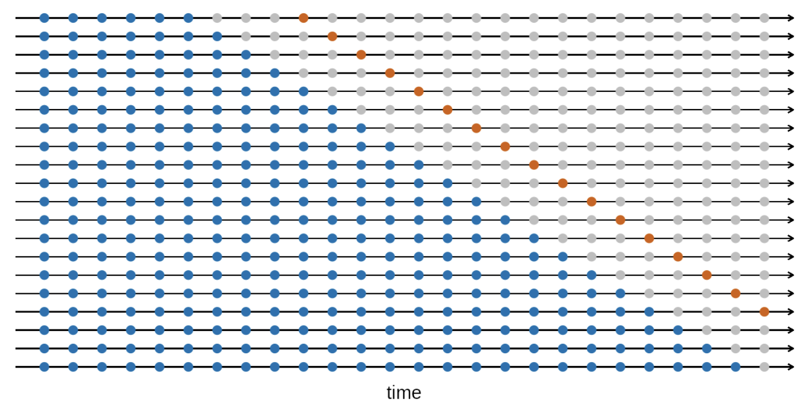

class: inverse, center, middle

# Introduction:

- Collaborate with National Health Service (NHS)- Wales in the UK
- Data length: 2012 Apr - 2023 Jun 
- Data frequency: monthly (135 time points)
- Goal of the project: forecast 6 months ahead of the emergency department attendance
- Use of the forecasting methods: base forecasting and hierarchical forecasting


---
class: inverse, center, middle

# Base Forecasting vs. Hierarchical Forecasting

### Different types of time series data
---
# Hierchical Structure

```{r setup, include=FALSE}
# Required Libraries
library(zoo)
library(ggplot2)
library(lubridate)
library(tsibble)
library(tidyverse)
library(fpp3)
library(hts)
library(dplyr)
library(tidyr)
library(forecast)
library(Metrics)
library(purrr)
library(tidyr)
library(stats)
library(fable)
library(dplyr)
library(igraph)
library(ggraph)
library(patchwork)
library(gridExtra)

```

```{r data, include=FALSE}
data <- read.csv("HLTH0037_ts_cleaned.csv")
```


```{r include=FALSE}
# change data structure
data <- data %>%
  mutate(YearMonth = yearmonth(YearMonth)) %>%
  as_tsibble(index = YearMonth, key = c(Age_Code, Sex_ItemName_ENG, Hospital_Code, Hospital_ItemName_ENG)) 

```


```{r small-plot, echo=FALSE, message=FALSE, warning=FALSE, out.width='80%',out.height='80%', fig.align='center', class.output='center-plot'}
library(igraph)

# Nodes data
nodes_df <- data.frame(
  name = c("All Wales", 
           "Betsi Cadwaladr", "Hywel Dda", "Grouped_4_organisation", 
           "Cardiff & Vale", "Aneurin Bevan", "Powys Teaching", 
           "Ysbyty Glan Clwyd", "Wrexham Maelor Hospital", "Colwyn Bay Community Hospital",
           "Holywell Community Hospital", "Mold Community Hospital"),
  stringsAsFactors = FALSE
)

# Edges data
edges_df <- data.frame(
  from = c(rep("All Wales", 6), 
           rep("Betsi Cadwaladr", 5)),
  to = c("Betsi Cadwaladr", "Hywel Dda", "Grouped_4_organisation", 
         "Cardiff & Vale", "Aneurin Bevan", "Powys Teaching",
         "Ysbyty Glan Clwyd", "Wrexham Maelor Hospital", "Colwyn Bay Community Hospital", 
         "Holywell Community Hospital", "Mold Community Hospital"),
  stringsAsFactors = FALSE
)


graph <- graph_from_data_frame(d = edges_df, vertices = nodes_df, directed = TRUE)


vertex_colors <- c("skyblue", rep("lightgreen", 6), rep("lightpink", 5))


# Plot the graph
plot(graph,
     vertex.size = 15,
     vertex.label = NA,  # Do not add labels
     vertex.color = vertex_colors,
     edge.arrow.size = 0.5,
     layout = layout.reingold.tilford(graph, root = 1))
legend("bottomright",
       legend = V(graph)$name,
       fill = vertex_colors,
       cex = 0.5,
       title = "Nodes",
       box.lty = 0)


```

---


# Number of patients entering ED under different hospital hierarchy
```{r attendance1, echo=FALSE, message=FALSE, warning=FALSE, out.width='60%',out.height='60%', fig.align='center', class.output='center-plot'}
# Aggregate the data
data_hts <- data %>%
  aggregate_key(Organisation/Hospital_ItemName_ENG, attendance = sum(Data))

# Plot the aggregated data

data_hts |>
  filter(is_aggregated(Hospital_ItemName_ENG)) |>
  autoplot(attendance) +
  labs(y = "Number of patients",
       title = "Number of patients who enter ED") +
  facet_wrap(vars(Organisation), scales = "free_y", ncol = 3) +
  theme(legend.position = "none")+
  theme(axis.text.x = element_text(angle = 45, hjust = 1),
        axis.text.y = element_text(angle = 0, hjust = 1)) 
```
---
```{r data_grouped, echo=FALSE, warning=FALSE}
# mutate Aggregated_Organisation due to the change of the health boards

data_grouped <- data %>%
  mutate(Aggregated_Organisation = case_when(
    Organisation %in% c("Cwm Taf", "Cwm Taf Morgannwg", "Abertawe Bro Morgannwg", "Swansea Bay") ~ "Grouped_4_organisation",
    TRUE ~ Organisation
  ))

```


## There are 6 Local Health Boards

- Aneurin Bevan
- Betsi Cadwaladr
- Hywel Dda
- Grouped_4_organisation
- Cardiff & Vale
- Powys Teaching
---

```{r hts, echo = FALSE, warning=FALSE}
data2_hts <- data_grouped %>%
  group_by(Aggregated_Organisation) %>%
  summarise(attendance = sum(Data)) 
```

# Number of patients who enter ED under 6 different local health boards
```{r attendance2, echo=FALSE, message=FALSE, warning=FALSE, out.width='60%', out.height='60%', fig.align='center', class.output='center-plot'}
data2_hts |>
  ggplot(aes(x = YearMonth, y = attendance)) +
  geom_line(stat = "identity") +
  labs(y = "Number of patients",
       title = "Number of patients who enter ED") +
  facet_wrap(vars(Aggregated_Organisation), scales = "free_y", ncol = 3) +
  theme(legend.position = "none") +
  theme(axis.text.x = element_text(angle = 45, hjust = 1))

```
---
# Findings:
- COVID-19 caused significant changes in patient attendance.

- Due to health regulations and concerns about virus infection, attendance at many local health boards decreased during the pandemic.

- The post-pandemic period showed a rise in attendance, with various boards showing distinct recovery path.

- Powys Teaching noticeably departed from the general upward recovery trend.

- Data show that attendance patterns appear to be seasonal across all health boards.

- Future efforts should concentrate on determining this seasonality's sources, effects, and incorporation into predictive forecasting models.

---

# STL decomposition

```{r stl, echo=FALSE, warning=FALSE}

# Decompose time series for each health board using STL
stl_decompositions <- data2_hts %>%
  split(.$Aggregated_Organisation) %>%
  purrr::map(function(data){
    ts_data <- ts(data$attendance, frequency = 12)
    stl(ts_data, s.window = "periodic")
  })

# Convert the decompositions to a tidy data frame
stl_df <- purrr::map2_dfr(stl_decompositions, names(stl_decompositions), 
                          ~{
                            time_series <- as.data.frame(.x$time.series)
                            time_series$Aggregated_Organisation <- .y
                            return(time_series)
                          })

```


```{r length, echo=FALSE, warning=FALSE}
num_months <- length(unique(data2_hts$YearMonth))
num_orgs <- length(unique(data2_hts$Aggregated_Organisation))

# Correct assignment for YearMonth column
stl_df$YearMonth <- rep(unique(data2_hts$YearMonth), times = num_orgs)

```

### Plotting

```{r longer, echo=FALSE, warning=FALSE}
stl_df_tidy <- stl_df %>%
  tidyr::pivot_longer(cols = c(trend, seasonal, remainder), 
                      names_to = "component", 
                      values_to = "value")

```


```{r stl_decom, echo=FALSE, message=FALSE, warning=FALSE, out.width='60%', out.height='60%', fig.align='center', class.output='center-plot'}
stl_df_tidy %>%
  ggplot(aes(x = YearMonth, y = value, color = component)) +
  geom_line() +
  facet_wrap(vars(Aggregated_Organisation), scales = "free_y", ncol = 3) +
  labs(title = "STL Decomposition of ED Attendance",
       y = "Number of Patients",
       color = "Component") +
  scale_color_manual(values = c("blue", "green", "red"),
                     breaks = c("trend", "seasonal", "remainder"),
                     labels = c("Trend", "Seasonal", "Residual")) +
  theme(legend.position = "bottom",
        axis.text.x = element_text(angle = 45, hjust = 1))

```

---
# Seasonality of number of attendances

```{r echo=FALSE, warning=FALSE , message=FALSE}
data_grouped |> 
  group_by(Aggregated_Organisation) |>
  summarise(`Number of patients` = sum(Data)) |>
  gg_season() +
  facet_wrap(vars(Aggregated_Organisation), scales = "free_y", nrow = 3)+
  theme(legend.position = "bottom",
        axis.text.x = element_text(angle = 45, hjust = 1)) +
  labs(title = "Seasonal plots of ED Attendances (by LHB)")
```


---
class: center, middle

- **Similar trends:** Consistent patient attendance patterns are revealed by STL decomposition across all health boards.
  
- **Impact of COVID-19:** The Covid-19 era is marked by a noticeable drop in attendance, which implies to a significant impact on healthcare utilisation or access.
  
- **An increase in mid-year attendance:** Every year, there is a noticeable rise in patient attendance around June or July, also drop in April and November, according to seasonal variations.
  
---

```{r  echo=FALSE, warning=FALSE}
#Change the data into wide format
data2_wide <- data_grouped %>%
  group_by(Aggregated_Organisation) %>%
  index_by(YearMonth) %>%
  summarise(attendance = sum(Data)) %>%
  pivot_wider(names_from = Aggregated_Organisation, values_from = attendance)


```

```{r  echo=FALSE, warning=FALSE}
data2_wide <- as_tibble(data2_wide)
data2_wide <- data2_wide %>%
   mutate(Total = rowSums(select(., c("Aneurin Bevan", "Betsi Cadwaladr", "Cardiff & Vale", "Grouped_4_organisation", "Hywel Dda", "Powys Teaching")), na.rm = TRUE))

```


# Forecast with ARIMA


```{r  echo=FALSE, warning=FALSE}

# Define the forecast horizon and validation period
h <- 12
validation_period <- 6

```


```{r  echo=FALSE, warning=FALSE}
# Splitting the data into training and testing sets
training_data <- head(data2_wide, nrow(data2_wide) - validation_period)
test_data <- tail(data2_wide, validation_period)

```


```{r  echo=FALSE, warning=FALSE}

cols_to_forecast <- c("Aneurin Bevan", "Betsi Cadwaladr", "Cardiff & Vale", "Grouped_4_organisation", "Hywel Dda", "Powys Teaching", "Total")
forecast_list <- list()

arima_forecast_list <- list()
start_year <- year(min(training_data$YearMonth))
start_month <- month(min(training_data$YearMonth))


for (col in cols_to_forecast) {
  ts_data <- ts(training_data[[col]], start = c(start_year, start_month), frequency = 12)
  arima_model <- auto.arima(ts_data)
  forecast_list[[col]] <- forecast(arima_model, h = h)
}
```


```{r  echo=FALSE, message=FALSE, warning=FALSE, out.width='70%', out.height='70%', fig.align='center', class.output='center-plot', fig.show='asis'}

arima_plots <- list()
for (col in cols_to_forecast) {
  
  end_year_train <- year(max(training_data$YearMonth))
  end_month_train <- month(max(training_data$YearMonth))
  
  start_year_test <- ifelse(end_month_train == 12, end_year_train + 1, end_year_train)
  start_month_test <- ifelse(end_month_train == 12, 1, end_month_train + 1)
  
  actual_ts <- ts(test_data[[col]], start = c(start_year_test, start_month_test), frequency = 12)
  
   p <- autoplot(forecast_list[[col]]) + 
        autolayer(actual_ts, series='Actual', PI=FALSE) + 
        labs(title = paste('Forecast vs Actual for', col)) + 
        theme(legend.position = 'bottom')+
     ylab("Attendance")
    
    arima_plots[[col]] <- p
}


```


```{r echo=FALSE, message=FALSE, warning=FALSE, out.width='70%', out.height='70%', fig.align='center', class.output='center-plot'}
print(arima_plots[['Total']])
```
---

# Arima model
```{r echo=FALSE, message=FALSE, warning=FALSE, out.width='70%', out.height='70%', fig.align='center', class.output='center-plot'}
print(arima_plots[['Aneurin Bevan']])
```


---
# Arima model
```{r echo=FALSE, message=FALSE, warning=FALSE, out.width='70%', out.height='70%', fig.align='center', class.output='center-plot'}
print(arima_plots[['Betsi Cadwaladr']])
```

---
# Arima model
```{r echo=FALSE, message=FALSE, warning=FALSE, out.width='70%', out.height='70%', fig.align='center', class.output='center-plot'}
print(arima_plots[['Cardiff & Vale']])
```

---
# Arima model
```{r echo=FALSE, message=FALSE, warning=FALSE, out.width='70%', out.height='70%', fig.align='center', class.output='center-plot'}
print(arima_plots[['Grouped_4_organisation']])
```

---
# Arima model
```{r echo=FALSE, message=FALSE, warning=FALSE, out.width='70%', out.height='70%', fig.align='center', class.output='center-plot'}
print(arima_plots[['Hywel Dda']])
```

---
# Arima model
```{r echo=FALSE, message=FALSE, warning=FALSE, out.width='70%', out.height='70%', fig.align='center', class.output='center-plot'}
print(arima_plots[['Hywel Dda']])
```

---
# Arima model
```{r echo=FALSE, message=FALSE, warning=FALSE, out.width='70%', out.height='70%', fig.align='center', class.output='center-plot'}
print(arima_plots[['Powys Teaching']])
```


---
# Forecasting with ETS

```{r echo = FALSE}

ets_forecast_list <- list()
start_year <- year(min(training_data$YearMonth))
start_month <- month(min(training_data$YearMonth))

for (Aggregated_Organisation in cols_to_forecast) {
  ts_data <- ts(training_data[[Aggregated_Organisation]], start = c(start_year, start_month), frequency = 12)
  ets_model <- ets(ts_data) 
  forecast_list[[Aggregated_Organisation]] <- forecast(ets_model, h = h)
}


```


```{r  echo=FALSE, message=FALSE, warning=FALSE, out.width='70%', out.height='70%', fig.align='center', class.output='center-plot', fig.show='asis'}

ets_plots <- list()
for (col in cols_to_forecast) {
  
  end_year_train <- year(max(training_data$YearMonth))
  end_month_train <- month(max(training_data$YearMonth))
  
  start_year_test <- ifelse(end_month_train == 12, end_year_train + 1, end_year_train)
  start_month_test <- ifelse(end_month_train == 12, 1, end_month_train + 1)
  
  actual_ts <- ts(test_data[[col]], start = c(start_year_test, start_month_test), frequency = 12)
  
   p <- autoplot(forecast_list[[col]]) + 
        autolayer(actual_ts, series='Actual', PI=FALSE) + 
        labs(title = paste('Forecast vs Actual for', col)) + 
        theme(legend.position = 'bottom')+
     ylab("Attendance")
    
    ets_plots[[col]] <- p
}


```


```{r echo=FALSE, message=FALSE, warning=FALSE, out.width='70%', out.height='70%', fig.align='center', class.output='center-plot'}
print(ets_plots[['Total']])
```
---

# ETS model
```{r echo=FALSE, message=FALSE, warning=FALSE, out.width='70%', out.height='70%', fig.align='center', class.output='center-plot'}
print(ets_plots[['Aneurin Bevan']])
```


---
# ETS model
```{r echo=FALSE, message=FALSE, warning=FALSE, out.width='70%', out.height='70%', fig.align='center', class.output='center-plot'}
print(ets_plots[['Betsi Cadwaladr']])
```

---
# ETS model
```{r echo=FALSE, message=FALSE, warning=FALSE, out.width='70%', out.height='70%', fig.align='center', class.output='center-plot'}
print(ets_plots[['Cardiff & Vale']])
```

---
# ETS model
```{r echo=FALSE, message=FALSE, warning=FALSE, out.width='70%', out.height='70%', fig.align='center', class.output='center-plot'}
print(ets_plots[['Grouped_4_organisation']])
```

---
# ETS model
```{r echo=FALSE, message=FALSE, warning=FALSE, out.width='70%', out.height='70%', fig.align='center', class.output='center-plot'}
print(ets_plots[['Hywel Dda']])
```


---
# ETS model
```{r echo=FALSE, message=FALSE, warning=FALSE, out.width='70%', out.height='70%', fig.align='center', class.output='center-plot'}
print(ets_plots[['Powys Teaching']])
```

---
# Calculating Accuracy Metrics for ARIMA and ETS
```{r echo=FALSE, warning=FALSE}
# Lists to store forecasts and error metrics
arima_forecast_list <- list()
ets_forecast_list <- list()
arima_error_metrics <- list()
ets_error_metrics <- list()
```


```{r  echo=FALSE, warning=FALSE}
# Forecasting with ARIMA and ETS
for (col in cols_to_forecast) {
  ts_data <- ts(training_data[[col]], start = c(start_year, start_month), frequency = 12)
  
  # ARIMA model
  arima_model <- auto.arima(ts_data)
  arima_forecast <- forecast(arima_model, h = h)
  arima_forecast_list[[col]] <- arima_forecast
  
  # ETS model
  tryCatch({
    ets_model <- ets(ts_data)
    ets_forecast <- forecast(ets_model, h = h)
    ets_forecast_list[[col]] <- ets_forecast
  }, error = function(e) {
    cat("Error in forecasting for column:", col, "with message:", e$message, "\n")
  })
}
```


```{r echo=FALSE, warning=FALSE}

for (col in cols_to_forecast) {
  actual <- test_data[[col]]
  
  arima_forecasted <- head(arima_forecast_list[[col]]$mean, validation_period)
  
  # ARIMA metrics
  arima_MAE <- mae(actual, arima_forecasted)
  arima_RMSE <- rmse(actual, arima_forecasted)
  arima_MAPE <- tryCatch(mape(actual, arima_forecasted), error = function(e) NA)
  arima_error_metrics[[col]] <- list(MAE = arima_MAE, RMSE = arima_RMSE, MAPE = arima_MAPE)
  
  # Check if ETS forecast exists for the column to avoid errors
  if (!is.null(ets_forecast_list[[col]])) {
    ets_forecasted <- head(ets_forecast_list[[col]]$mean, validation_period)
    
    # ETS metrics
    ets_MAE <- mae(actual, ets_forecasted)
    ets_RMSE <- rmse(actual, ets_forecasted)
    ets_MAPE <- tryCatch(mape(actual, ets_forecasted), error = function(e) NA)
    ets_error_metrics[[col]] <- list(MAE = ets_MAE, RMSE = ets_RMSE, MAPE = ets_MAPE)
  }
}

```


```{r echo=FALSE, warning=FALSE, out.height= '50%'}
TableAccuracyMetrics <-
  rbind(
    # aggregate ARIMA accuracy metrics
    as.data.frame(
      do.call(rbind,unlist(arima_error_metrics, recursive=FALSE))
      ) |>
      rename(Metric = V1) |>
      rownames_to_column("LHB") |>
      mutate(
        Metric = round(Metric,3),
        Model = "ARIMA"
        ),
    
    # aggregate ETS accuracy metrics
    as.data.frame(
      do.call(rbind,unlist(ets_error_metrics, recursive=FALSE))
      ) |>
      rename(Metric = V1) |>
      rownames_to_column("LHB") |>
      mutate(
        Metric = round(Metric,3),
        Model = "ETS"
        )
    ) |>
  
  ## wrangle table from long to wide format
  tidyr::pivot_wider(
    names_from = Model, 
    values_from = Metric
  )

TableAccuracyMetrics |> knitr::kable()
```


---

class: center, middle
**Result:**

- With Cardiff & Vale being a significant exception, most places displayed reduced error metrics when modeled with ETS, signifying a higher predictive accuracy as compared to the ARIMA model.


---

# Reconciliation

## Step 1: Aggregate the data


```{r echo=FALSE, warning=FALSE, include = FALSE}
data_grouped_age <- data_grouped %>%
  filter(Age_Code != "Unknown") %>%
  mutate(Grouped_Age = case_when(
    Age_Code == "0 to 4" ~ "0-4",
    Age_Code == "5 to 17" ~ "5-17",
    Age_Code %in% c("18 to 24", "25 to 29", "30 to 34", "35 to 39", 
                    "40 to 44", "45 to 49", "50 to 54", "55 to 59", 
                    "60 to 64", "65 to 69") ~ "18-69",
    Age_Code %in% c("70 to 74", "75 to 79", "80 to 84", "85") ~ "70 and over",
    TRUE ~ "Other"
  ))

```


```{r echo=FALSE, warning=FALSE, include = FALSE}
data_gts <- data_grouped_age |>
  aggregate_key((Aggregated_Organisation / Hospital_ItemName_ENG) * Grouped_Age, attendance = sum(Data))
```

- Hierarchical structure:

Parent: Aggregated_Organisation

Child: Hospital_ItemName_ENG

Group: Grouped_Age

aggregate_key: attendance

```{r echo=FALSE, warning=FALSE, include = FALSE}
data_gts <- data_gts %>%
  as_tsibble(key = c("Aggregated_Organisation", "Grouped_Age", "Hospital_ItemName_ENG"), index = "YearMonth")


```

---

# Step 2: Time series cross validation

```{r echo=FALSE, warning=FALSE, include = FALSE}
library(dplyr)

# Define the expected number of rows for the entire time series
expected_length <- nrow(unique(data_gts[,"YearMonth"]))
# Obtain the data for the entire time series for the purpose of reconciliation
cleaned_data <- data_gts %>%
  group_by(Aggregated_Organisation, Grouped_Age, Hospital_ItemName_ENG) %>%
  filter(n() == expected_length) %>%
  ungroup()
```


```{r echo=FALSE, warning=FALSE, include = FALSE}
library(fable.tscount)
library(tscount)
# Split data
training_data <- cleaned_data %>% 
  filter(YearMonth <= yearmonth("2022 Jun"))

test_data <- cleaned_data %>% 
  filter(YearMonth > yearmonth("2022 Jun")) 

test_data_filtered <- test_data %>%
  filter(Aggregated_Organisation == "<aggregated>")


```


```{r echo=FALSE, warning=FALSE, include = FALSE}
library(tsibble)

start_date <- min(training_data$YearMonth)
end_date <- max(training_data$YearMonth)

# Calculate the difference in months using yearmonth
number_of_months <- as.integer(yearmonth(end_date) - yearmonth(start_date)) + 1

number_of_months
```

```{r echo=FALSE, warning=FALSE, include = FALSE}
data_gts_tr <- cleaned_data |>
  stretch_tsibble(.init = 123, .step = 1) 
```

```{r echo=FALSE}

```

```{r echo=FALSE, warning=FALSE, include = FALSE}
filtered_tr <- data_gts_tr %>%
  filter(Aggregated_Organisation == "<aggregated>")
```


```{r echo=FALSE, warning=FALSE, include = FALSE}
data_gts_fc <-filtered_tr |>
  model(
    naive_model = NAIVE(attendance),
    ets_model = ETS(attendance),
    tscount = TSCOUNT(attendance ~ trend() + season() , link = "log", model = list(past_obs = 1:12))
  )|> mutate (comb = (naive_model+ets_model+tscount)/3) %>%
  forecast(h = 12) 
```


---
# Check accuracy

```{r echo=FALSE, warning=FALSE}


merged_data <- left_join(as_tibble(data_gts_fc), as_tibble(test_data_filtered), by = c("YearMonth", "Aggregated_Organisation","Grouped_Age", "Hospital_ItemName_ENG"))

# Create an empty list to store results
results_list <- list()

# List of models
model_names <- unique(merged_data$.model)

# List of training datasets (using .id)
training_ids <- unique(merged_data$.id)

# Nested loop: first loop through models, then loop through training datasets
for (model in model_names) {
  results_list[[model]] <- list()  # Initialize a nested list for each model
  
  for (id in training_ids) {
    # Filter the data for the current model and training dataset
    subset_data <- merged_data %>% filter(.model == model & .id == id)
    
    # Calculate MASE and RMSSE
    mase_val <- mean(abs((subset_data$attendance.y - subset_data$.mean) / 
                         (subset_data$attendance.y - lag(subset_data$attendance.y))), na.rm = TRUE)
    rmsse_val <- sqrt(mean((subset_data$attendance.y - subset_data$.mean)^2, na.rm = TRUE))
    
    # Store results in the nested list
    results_list[[model]][[as.character(id)]] <- list(MASE = mase_val, RMSSE = rmsse_val)
  }
}

# List to store averaged results
averaged_results <- list()

for (model in model_names) {
  # Extract the list of results for the current model
  model_results <- results_list[[model]]
  
  # Calculate the average MASE and RMSSE over the 13 training datasets while removing NA values
  avg_mase <- mean(sapply(model_results, function(x) x$MASE), na.rm = TRUE)
  avg_rmsse <- mean(sapply(model_results, function(x) x$RMSSE), na.rm = TRUE)
  
  # Store the averaged results
  averaged_results[[model]] <- list(Avg_MASE = avg_mase, Avg_RMSSE = avg_rmsse)
}

# ... [previous code remains unchanged]

# Convert averaged_results to a dataframe
averaged_df <- data.frame(model = names(averaged_results))

# Extract Avg_MASE and Avg_RMSSE values for each model
averaged_df$Avg_MASE <- sapply(averaged_results, function(x) x$Avg_MASE)
averaged_df$Avg_RMSSE <- sapply(averaged_results, function(x) x$Avg_RMSSE)

print(averaged_df)


```

---

# Reconciliation


```{r echo=FALSE, warning=FALSE, include = FALSE}
# remove naive_model, and use comb as the base model
library(fable.tscount)
fit_gts <- cleaned_data %>%
 model(
    ets_model = ETS(attendance),
    tscount = TSCOUNT(attendance ~ trend() + season() , link = "log", model = list(past_obs = 1:12))
  )|> mutate (comb = (ets_model+tscount)/2)  %>%
  reconcile(
    bu = bottom_up(comb),
    ols = min_trace(comb, method = "ols")
  )
```

```{r echo=FALSE, warning=FALSE, include = FALSE}
fc_gts <- fit_gts %>%
  forecast(h = 6)

```

```{r echo=FALSE, warning=FALSE}
fc_gts |>
  filter(is_aggregated(Hospital_ItemName_ENG), is_aggregated(Grouped_Age)) |>
  autoplot(
    cleaned_data,
    level = NULL
  ) +
  labs(y = "attendance") +
  facet_wrap(vars(Aggregated_Organisation), scales = "free_y")+
  theme(axis.text.x = element_text(angle = 45, hjust = 1))
```
---
# A closer look:
```{r echo=FALSE, warning=FALSE}
fc_gts |>
  filter(is_aggregated(Hospital_ItemName_ENG), is_aggregated(Grouped_Age)) |>
  autoplot(
    cleaned_data %>% filter(YearMonth >= yearmonth("2022 Jan")),
    level = NULL
  ) +
  labs(y = "attendance") +
  facet_wrap(vars(Aggregated_Organisation), scales = "free_y")+
  theme(axis.text.x = element_text(angle = 45, hjust = 1))
```


---
class: center, middle
# Conclusion

Why the forecast is declining:

- Seasonal Effects: Some months or seasons may naturally draw lesser crowds, maybe as a result of a lack of prevalent diseases or ailments that peak in other months.

- Holiday Effects: Vieira et al 2023: "[on holidays] people may prefer to postpone their visit to the ED rather than lose their free time"
